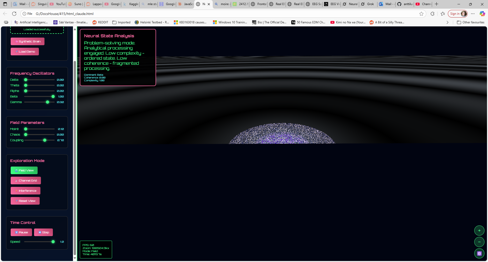

# Neural Moiré Explorer

An interactive, real-time visualization of simulated EEG data, exploring the concept of inter-frequency coupling through the 
emergence of neural moiré patterns.

# About The Project
This project visualizes brainwave activity not as simple lines, but as a dynamic, overlapping field of wave patterns.
It uses three.js to render a complex shader that simulates five primary EEG frequency bands (Delta, Theta, Alpha, Beta, Gamma)
as distinct layers.

The most interesting aspect of this simulation is its ability to visualize the interaction between these frequency bands.

# The Core Concept: Visualizing Inter-Frequency Coupling

In neuroscience, "cross-frequency coupling" is a theory suggesting that different brain rhythms interact to carry
complex information. This visualizer models that concept directly:

Colored Layers: Each frequency band (Alpha, Beta, etc.) is represented by a colored, fractal-like pattern.

Moiré Interference: When these layers overlap, they create interference patterns, much like the moiré effect seen when two
fine grids are overlaid.

Visualizing Coupling: The bright white/gray patterns that emerge are not random; they are a direct visualization of the
coupling strength between specific frequency pairs (e.g., Theta-Alpha, Alpha-Beta). The intensity of this white "glow" 
is controlled by the Coupling parameter, representing the strength of the neural binding.

By rotating the plane in 3D, you can see these coupling patterns stretch towards the horizon, offering a unique
perspective on the simulated neural field.

# Features

Real-time Visualization: A dynamic field powered by a three.js shader.

Interactive Controls: Manipulate the amplitude of 5 different EEG frequency bands.

Field Parameters: Adjust Moiré intensity, Chaos, and the crucial Coupling strength.

Data Simulation: Generate synthetic brainwave data or load a demo "meditation" state.

3D Navigation: Drag to rotate the field and use the mouse wheel to zoom.

Quantum Zoom: A special mode to zoom to a massive scale, simulating quantum-level noise.

Keyboard Shortcuts: Full control via keyboard for power users.

# Controls

Control	Action

Mouse Drag	Rotate the neural field in 3D.

Mouse Wheel	Zoom in and out.

Spacebar	Play / Pause the time simulation.

R	Reset the view to the default state.

Q	Engage "Quantum Zoom".

+ / -	Zoom in / out.

1, 2, 3	Switch between visualization modes.

# Technology Stack

HTML5
CSS3
JavaScript (ES6+)
three.js (for WebGL rendering)

# Running Locally

As this is a self-contained project, no build step is required.

Clone the repository:

git clone https://github.com/anttiluode/CircularEEGMoirePatternVisualizer.git
Use code with caution.
Sh
Open the index.html (or the main HTML file) in your web browser.
